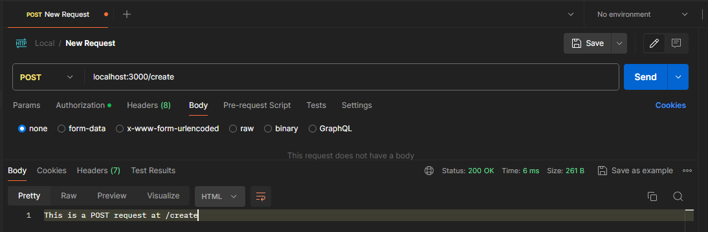
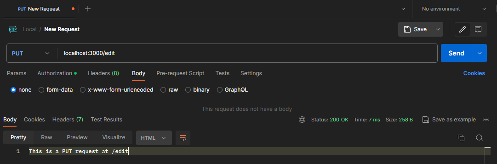
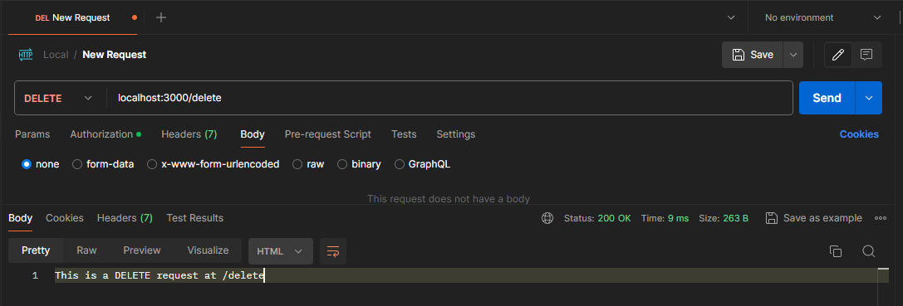
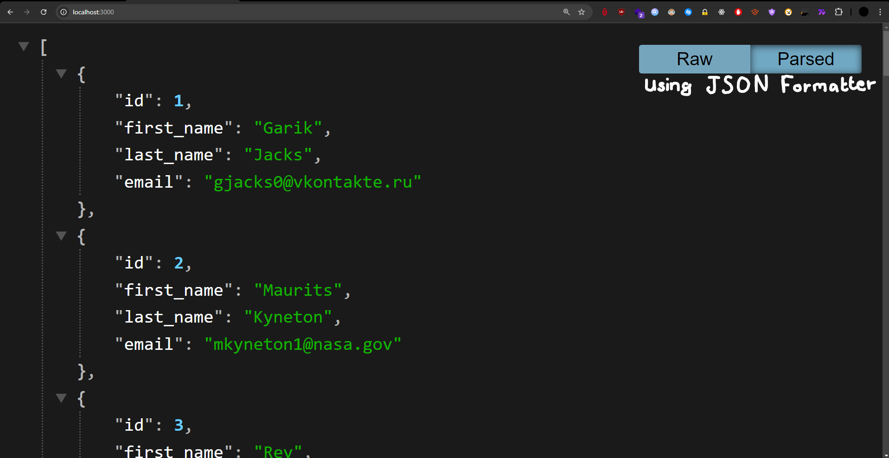

# Express Essentials Build Powerful Web Apps with Nodejs
 Following a LinkedIn Learning Course from Jamie Pittman
 

## Postman: A free tool for testing

### GET REQUEST

### POST REQUEST

### PUT REQUEST

### DELETE REQUEST

## Let's GET some data: Creating a basic data endpoint
